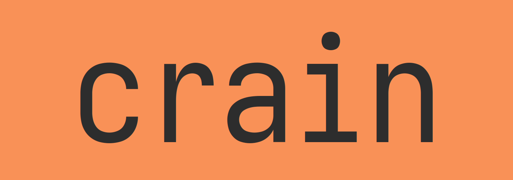

<div align="center">
  <br>
  <p align="center"><b>Language-agnostic project construction from opinionated, composable templates.</b></p>

  [![Build Status][build-badge]][build-url]
  [![GoDev][godev-badge]][godev-url]
  [![License][license-badge]][license-url]
  [![codecov][codecov-badge]][codecov-url]
  [![Release][release-badge]][release-url]
</div>

[build-badge]: https://github.com/mccurdyc/crain/workflows/build-test/badge.svg
[build-url]: https://github.com/mccurdyc/crain/actions
[godev-badge]: https://pkg.go.dev/badge/github.com/mccurdyc/crain
[godev-url]: https://pkg.go.dev/github.com/mccurdyc/crain?tab=overview
[license-badge]: https://img.shields.io/github/license/mccurdyc/crain
[license-url]: LICENSE
[codecov-badge]: https://codecov.io/gh/mccurdyc/crain/branch/master/graph/badge.svg
[codecov-url]: https://codecov.io/gh/mccurdyc/crain
[release-badge]: https://img.shields.io/github/release/mccurdyc/crain.svg
[release-url]: https://github.com/mccurdyc/crain/releases/latest

## Overview

Language-agnostic project construction from opinionated, composable templates.

crain differs from, say GitHub templates, in that a primary goal crain is composability
of templates from (in the future) arbitrary targets, while GitHub templates are
more focused on providing an all-encompassing template for a new project or repository.

### Goals

My goal with this project, specifically with the templates is to "document"
the opinions that I currently hold, in the form of templates that can be shared and used by
others or minimally, be used as a reference. While these opinions are my own,
they have absolutely been influenced by the work of others.

Additionally, the current templates are pretty focused on the Go programming language
since that is my primary general-purpose programming language.

### Non-goals

TODO

## Installing

```sh
(
  d=$(mktemp -d) cd $d
  go get -u -v github.com/mccurdyc/crain
  go install github.com/mccurdyc/crain
)
```

## Usage

```sh
% crain project -h
USAGE
  project <subcommand>

SUBCOMMANDS
  generate  Generates a new project.

FLAGS
  -config config.toml       A config file defining values for the required variables for all templates used.
  -destination .            The destination directory where the project should be created.
  -templates glue           A comma-separate list of template names.
  -templates-path ./_tmpls  Path to templates.
```

## Contributing

+ [Check out the CONTRIBUTING document.](./CONTRIBUTING.md)

## License

+ [GNU General Public License Version 3](./LICENSE)

[](https://app.fossa.io/projects/git%2Bgithub.com%2Fmccurdyc%2Fcrain?ref=badge_large)

## TODOs

1. ~Handle `crain` with missing subcommands.~
1. ~GitHub Action for CI (build and test).~
1. ~Backport changes to crain to the template files.~
1. Copy the contents of the template directory, but not the directory itself.
1. Refactor / cleanup the tests in `exec_test.go`. There is a lot of duplicated logic and lack of table-testing.
1. `version` subcommand for `crain` and accompanying template.
1. When copying a template, don't copy the `variables.hcl` file.
1. Parse and check the supplied variables against the `variables.hcl` file in templates.
1. Simplify each template so that they are more composable and align with the Unix philosophy of doing one thing.
1. Render templated filenames.
1. Configurable template delimeters.
1. Move templates to a separate GitHub repository.
1. Generate README usage section via Make target or something.
